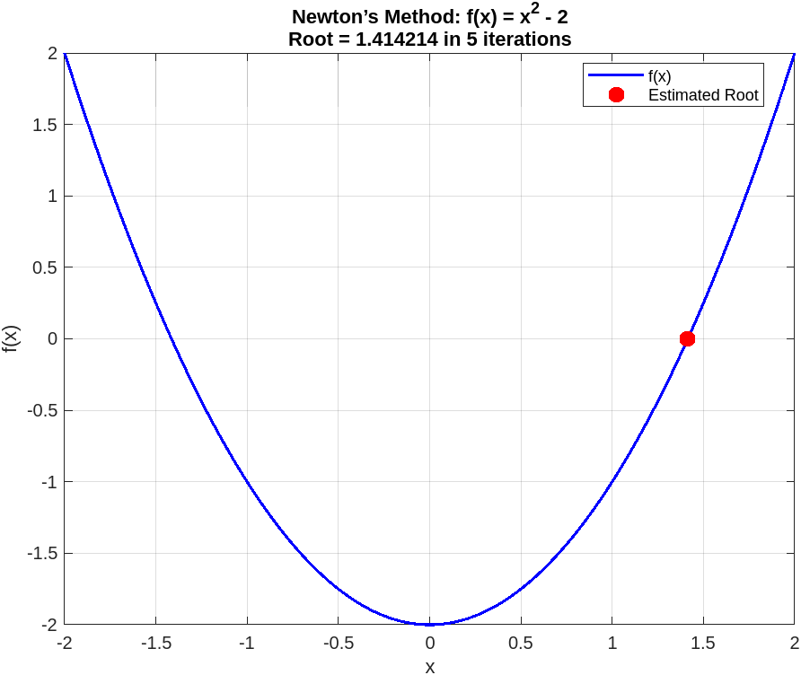
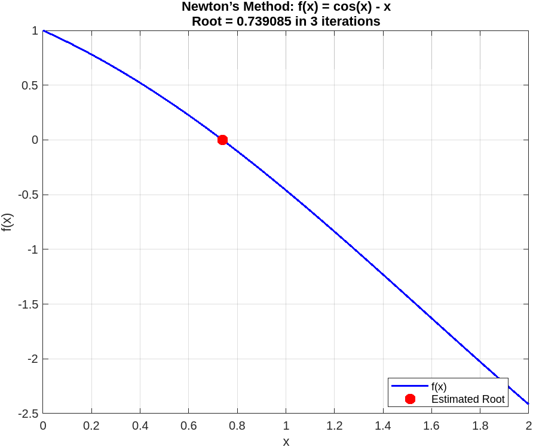

# Gradient Descent
This project implements Newton's method for root-finding from scratch in MATLAB.

It includes:
- A configurable Newton solver supporting:
  - Custom functions and derivatives
  - Early stopping via tolerance
- Example test functions:
  - f(x) = x^2 - 2
  - f(x) = cos(x) - x

## Author
Serge Alhalbi

## Company
Riverain Technologies

## Collaborators
- Jason Knapp  
- Xiaotian (Dennis) Wu

## Tools and Libraries
- MATLAB

## Usage
```bash
git clone https://github.com/SergeAlhalbi/newtons-method.git
cd newtons-method
```

## Results
Below are the results of Newton's method applied to two nonlinear functions:

- **Function:** f(x) = x^2 - 2:
  
  

- **Function:** f(x) = cos(x) - x:
  
  
